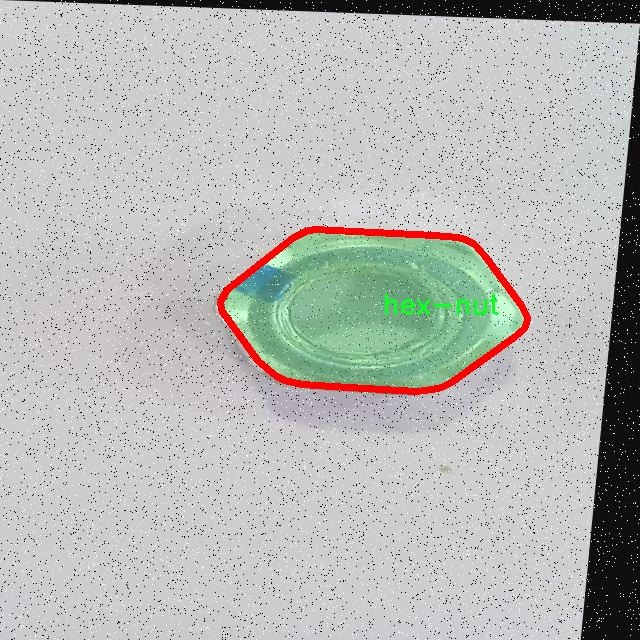

### 1.背景意义

研究背景与意义

随着工业自动化和智能制造的快速发展，视觉识别技术在生产和质量控制中的应用愈发重要。六角螺母作为机械和建筑行业中常见的紧固件，其在生产和装配过程中的识别与分割成为了提升效率和降低成本的关键环节。传统的图像处理方法在处理复杂背景、遮挡以及多样化形状的六角螺母时，往往面临准确率低和处理速度慢的问题。因此，开发一种高效、准确的实例分割系统显得尤为必要。

YOLO（You Only Look Once）系列模型因其高效的实时目标检测能力而受到广泛关注。随着YOLOv11的推出，其在目标检测精度和速度上的显著提升为实例分割任务提供了新的可能性。然而，现有的YOLOv11模型在处理特定物体（如六角螺母）时，仍需针对性地进行改进，以适应不同的应用场景和数据集特征。因此，基于改进YOLOv11的六角螺母实例分割系统的研究，不仅能够提高六角螺母的检测和分割精度，还能为其他类似物体的识别提供借鉴。

本研究将围绕六角螺母的特征进行深入分析，利用改进的YOLOv11模型进行数据集的训练和测试，探索在不同光照、角度和背景下的实例分割效果。通过构建一个高效的实例分割系统，旨在为工业生产提供一种智能化的解决方案，从而提升生产线的自动化水平和产品质量。此外，该研究还将为计算机视觉领域的实例分割技术发展提供新的思路和方法，推动相关技术的进步与应用。

### 2.视频效果

[2.1 视频效果](https://www.bilibili.com/video/BV1sykjYKEpK/)

### 3.图片效果


##### [项目涉及的源码数据来源链接](https://kdocs.cn/l/cszuIiCKVNis)**

注意：本项目提供训练的数据集和训练教程,由于版本持续更新,暂不提供权重文件（best.pt）,请按照6.训练教程进行训练后实现上图演示的效果。

### 4.数据集信息

##### 4.1 本项目数据集类别数＆类别名

nc: 1
names: ['hex-nut']


该项目为【图像分割】数据集，请在【训练教程和Web端加载模型教程（第三步）】这一步的时候按照【图像分割】部分的教程来训练

##### 4.2 本项目数据集信息介绍

本项目数据集信息介绍

本项目旨在改进YOLOv11的六角螺母实例分割系统，因此我们构建了一个专门针对“Hex Nuts Instance”的数据集。该数据集包含了丰富的六角螺母图像，旨在为模型的训练提供多样化的样本，以提高其在实际应用中的准确性和鲁棒性。数据集中仅包含一个类别，即“hex-nut”，这使得模型在特定任务上能够更专注于特征学习，减少了类别间的干扰。

为了确保数据集的质量和多样性，我们在不同的环境和条件下采集了大量的六角螺母图像。这些图像涵盖了多种拍摄角度、光照条件以及背景设置，确保模型能够在各种情况下识别和分割六角螺母。数据集中不仅包含清晰的六角螺母图像，还包括一些模糊、遮挡和不同材质的样本，以增强模型的泛化能力。

在数据预处理阶段，我们对图像进行了标注，确保每个六角螺母的实例都被准确地框定和标识。这一过程不仅提高了数据集的可用性，也为后续的模型训练提供了可靠的基础。数据集的规模经过精心设计，以确保在训练过程中模型能够获得足够的样本量，从而有效地学习到六角螺母的特征。

总之，本项目的数据集为改进YOLOv11的六角螺母实例分割系统提供了强有力的支持。通过精心设计和多样化的样本，我们期望能够显著提升模型在实际应用中的表现，使其在工业生产、自动化装配等领域发挥更大的作用。





### 5.全套项目环境部署视频教程（零基础手把手教学）

[5.1 所需软件PyCharm和Anaconda安装教程（第一步）](https://www.bilibili.com/video/BV1BoC1YCEKi/?spm_id_from=333.999.0.0&vd_source=bc9aec86d164b67a7004b996143742dc)


[5.2 安装Python虚拟环境创建和依赖库安装视频教程（第二步）](https://www.bilibili.com/video/BV1ZoC1YCEBw?spm_id_from=333.788.videopod.sections&vd_source=bc9aec86d164b67a7004b996143742dc)

### 6.改进YOLOv11训练教程和Web_UI前端加载模型教程（零基础手把手教学）

[6.1 改进YOLOv11训练教程和Web_UI前端加载模型教程（第三步）](https://www.bilibili.com/video/BV1BoC1YCEhR?spm_id_from=333.788.videopod.sections&vd_source=bc9aec86d164b67a7004b996143742dc)


按照上面的训练视频教程链接加载项目提供的数据集，运行train.py即可开始训练



     Epoch   gpu_mem       box       obj       cls    labels  img_size
     1/200     20.8G   0.01576   0.01955  0.007536        22      1280: 100%|██████████| 849/849 [14:42<00:00,  1.04s/it]
               Class     Images     Labels          P          R     mAP@.5 mAP@.5:.95: 100%|██████████| 213/213 [01:14<00:00,  2.87it/s]
                 all       3395      17314      0.994      0.957      0.0957      0.0843

     Epoch   gpu_mem       box       obj       cls    labels  img_size
     2/200     20.8G   0.01578   0.01923  0.007006        22      1280: 100%|██████████| 849/849 [14:44<00:00,  1.04s/it]
               Class     Images     Labels          P          R     mAP@.5 mAP@.5:.95: 100%|██████████| 213/213 [01:12<00:00,  2.95it/s]
                 all       3395      17314      0.996      0.956      0.0957      0.0845

     Epoch   gpu_mem       box       obj       cls    labels  img_size
     3/200     20.8G   0.01561    0.0191  0.006895        27      1280: 100%|██████████| 849/849 [10:56<00:00,  1.29it/s]
               Class     Images     Labels          P          R     mAP@.5 mAP@.5:.95: 100%|███████   | 187/213 [00:52<00:00,  4.04it/s]
                 all       3395      17314      0.996      0.957      0.0957      0.0845


###### [项目数据集下载链接](https://kdocs.cn/l/cszuIiCKVNis)

### 7.原始YOLOv11算法讲解

YOLOv11是Ultralytics推出的YOLO系列最新版本，专为实现尖端的物体检测而设计。其架构和训练方法上进行了重大改进，使之不仅具备卓越的准确性和处理速度，还在计算效率上实现了一场革命。得益于其改进的主干和颈部架构，YOLOv11在特征提取和处理复杂任务时表现更加出色。在2024年9月27日，Ultralytics通过长达九小时的在线直播发布这一新作，展示了其在计算机视觉领域的革新。

YOLOv11通过精细的架构设计和优化训练流程，在保持高精度的同时，缩减了参数量，与YOLOv8m相比减少了22%的参数，使其在COCO数据集上的平均准确度（mAP）有所提升。这种效率的提高使YOLOv11非常适合部署在各种硬件环境中，包括边缘设备、云计算平台以及支持NVIDIA GPU的系统，确保在灵活性上的优势。

该模型支持广泛的任务，从对象检测、实例分割到图像分类、姿态估计和定向对象检测（OBB），几乎覆盖了计算机视觉的所有主要挑战。其创新的C3k2和C2PSA模块提升了网络深度和注意力机制的应用，提高了特征提取的效率和效果。同时，YOLOv11的改进网络结构也使之在复杂视觉任务上得以从容应对，成为各类计算机视觉任务的多功能选择。这些特性令YOLOv11在实施实时物体检测的各个领域中表现出众。
* * *

2024年9月27日，Ultralytics在线直播长达九小时，为YOLO11召开“发布会”

YOLO11 是 Ultralytics YOLO 系列实时物体检测器的最新版本，它以尖端的准确性、速度和效率重新定义了可能性。在之前 YOLO
版本的显著进步的基础上，YOLO11 在架构和训练方法方面进行了重大改进，使其成为各种计算机视觉任务的多功能选择。


##### YOLO11主要特点：

  * 增强的特征提取：YOLO11 采用了改进的主干和颈部架构，增强了特征提取能力，可实现更精确的对象检测和复杂任务性能。
  * 针对效率和速度进行了优化：YOLO11 引入了完善的架构设计和优化的训练流程，可提供更快的处理速度，并在准确度和性能之间保持最佳平衡。
  * 更少的参数，更高的准确度：借助模型设计的进步，YOLO11m 在 COCO 数据集上实现了更高的平均准确度 (mAP)，同时使用的参数比 YOLOv8m 少 22%，从而提高了计算效率，同时又不影响准确度。
  * 跨环境的适应性：YOLO11 可以无缝部署在各种环境中，包括边缘设备、云平台和支持 NVIDIA GPU 的系统，从而确保最大的灵活性。
  * 支持的任务范围广泛：无论是对象检测、实例分割、图像分类、姿势估计还是定向对象检测 (OBB)，YOLO11 都旨在满足各种计算机视觉挑战。

##### 支持的任务和模式

YOLO11 以 YOLOv8 中引入的多功能模型系列为基础，为各种计算机视觉任务提供增强的支持：

Model| Filenames| Task| Inference| Validation| Training| Export  
---|---|---|---|---|---|---  
YOLO11| yolol11n.pt, yolol11s.pt, yolol11m.pt, yolol11x.pt| Detection| ✅| ✅|
✅| ✅  
YOLO11-seg| yolol11n-seg.pt, yolol11s-seg.pt, yolol11m-seg.pt,
yolol11x-seg.pt| Instance Segmentation| ✅| ✅| ✅| ✅  
YOLO11-pose| yolol11n-pose.pt, yolol11s-pose.pt, yolol11m-pose.pt,
yolol11x-pose.pt| Pose/Keypoints| ✅| ✅| ✅| ✅  
YOLO11-obb| yolol11n-obb.pt, yolol11s-obb.pt, yolol11m-obb.pt,
yolol11x-obb.pt| Oriented Detection| ✅| ✅| ✅| ✅  
YOLO11-cls| yolol11n-cls.pt, yolol11s-cls.pt, yolol11m-cls.pt,
yolol11x-cls.pt| Classification| ✅| ✅| ✅| ✅  
  
##### 简单的 YOLO11 训练和推理示例

以下示例适用于用于对象检测的 YOLO11 Detect 模型。

    
    
    from ultralytics import YOLO
    
    # Load a model
    model = YOLO("yolo11n.pt")
    
    # Train the model
    train_results = model.train(
        data="coco8.yaml",  # path to dataset YAML
        epochs=100,  # number of training epochs
        imgsz=640,  # training image size
        device="cpu",  # device to run on, i.e. device=0 or device=0,1,2,3 or device=cpu
    )
    
    # Evaluate model performance on the validation set
    metrics = model.val()
    
    # Perform object detection on an image
    results = model("path/to/image.jpg")
    results[0].show()
    
    # Export the model to ONNX format
    path = model.export(format="onnx")  # return path to exported model

##### 支持部署于边缘设备

YOLO11 专为适应各种环境而设计，包括边缘设备。其优化的架构和高效的处理能力使其适合部署在边缘设备、云平台和支持 NVIDIA GPU
的系统上。这种灵活性确保 YOLO11 可用于各种应用，从移动设备上的实时检测到云环境中的复杂分割任务。有关部署选项的更多详细信息，请参阅导出文档。

##### YOLOv11 yaml文件

    
    
    # Ultralytics YOLO 🚀, AGPL-3.0 license
    # YOLO11 object detection model with P3-P5 outputs. For Usage examples see https://docs.ultralytics.com/tasks/detect
    
    # Parameters
    nc: 80 # number of classes
    scales: # model compound scaling constants, i.e. 'model=yolo11n.yaml' will call yolo11.yaml with scale 'n'
      # [depth, width, max_channels]
      n: [0.50, 0.25, 1024] # summary: 319 layers, 2624080 parameters, 2624064 gradients, 6.6 GFLOPs
      s: [0.50, 0.50, 1024] # summary: 319 layers, 9458752 parameters, 9458736 gradients, 21.7 GFLOPs
      m: [0.50, 1.00, 512] # summary: 409 layers, 20114688 parameters, 20114672 gradients, 68.5 GFLOPs
      l: [1.00, 1.00, 512] # summary: 631 layers, 25372160 parameters, 25372144 gradients, 87.6 GFLOPs
      x: [1.00, 1.50, 512] # summary: 631 layers, 56966176 parameters, 56966160 gradients, 196.0 GFLOPs
    
    # YOLO11n backbone
    backbone:
      # [from, repeats, module, args]
      - [-1, 1, Conv, [64, 3, 2]] # 0-P1/2
      - [-1, 1, Conv, [128, 3, 2]] # 1-P2/4
      - [-1, 2, C3k2, [256, False, 0.25]]
      - [-1, 1, Conv, [256, 3, 2]] # 3-P3/8
      - [-1, 2, C3k2, [512, False, 0.25]]
      - [-1, 1, Conv, [512, 3, 2]] # 5-P4/16
      - [-1, 2, C3k2, [512, True]]
      - [-1, 1, Conv, [1024, 3, 2]] # 7-P5/32
      - [-1, 2, C3k2, [1024, True]]
      - [-1, 1, SPPF, [1024, 5]] # 9
      - [-1, 2, C2PSA, [1024]] # 10
    
    # YOLO11n head
    head:
      - [-1, 1, nn.Upsample, [None, 2, "nearest"]]
      - [[-1, 6], 1, Concat, [1]] # cat backbone P4
      - [-1, 2, C3k2, [512, False]] # 13
    
      - [-1, 1, nn.Upsample, [None, 2, "nearest"]]
      - [[-1, 4], 1, Concat, [1]] # cat backbone P3
      - [-1, 2, C3k2, [256, False]] # 16 (P3/8-small)
    
      - [-1, 1, Conv, [256, 3, 2]]
      - [[-1, 13], 1, Concat, [1]] # cat head P4
      - [-1, 2, C3k2, [512, False]] # 19 (P4/16-medium)
    
      - [-1, 1, Conv, [512, 3, 2]]
      - [[-1, 10], 1, Concat, [1]] # cat head P5
      - [-1, 2, C3k2, [1024, True]] # 22 (P5/32-large)
    
      - [[16, 19, 22], 1, Detect, [nc]] # Detect(P3, P4, P5)
    

**YOLO11和YOLOv8 yaml文件的区别**


##### 改进模块代码

  * C3k2 

    
    
    class C3k2(C2f):
        """Faster Implementation of CSP Bottleneck with 2 convolutions."""
    
        def __init__(self, c1, c2, n=1, c3k=False, e=0.5, g=1, shortcut=True):
            """Initializes the C3k2 module, a faster CSP Bottleneck with 2 convolutions and optional C3k blocks."""
            super().__init__(c1, c2, n, shortcut, g, e)
            self.m = nn.ModuleList(
                C3k(self.c, self.c, 2, shortcut, g) if c3k else Bottleneck(self.c, self.c, shortcut, g) for _ in range(n)
            )

C3k2，它是具有两个卷积的CSP（Partial Cross Stage）瓶颈架构的更快实现。

**类继承：**

  * `C3k2`继承自类`C2f`。这表明`C2f`很可能实现了经过修改的基本CSP结构，而`C3k2`进一步优化或修改了此结构。

**构造函数（`__init__`）：**

  * `c1`：输入通道。

  * `c2`：输出通道。

  * `n`：瓶颈层数（默认为1）。

  * `c3k`：一个布尔标志，确定是否使用`C3k`块或常规`Bottleneck`块。

  * `e`：扩展比率，控制隐藏层的宽度（默认为0.5）。

  * `g`：分组卷积的组归一化参数或组数（默认值为 1）。

  * `shortcut`：一个布尔值，用于确定是否在网络中包含快捷方式连接（默认值为 `True`）。

**初始化：**

  * `super().__init__(c1, c2, n, short-cut, g, e)` 调用父类 `C2f` 的构造函数，初始化标准 CSP 组件，如通道数、快捷方式、组等。

**模块列表（`self.m`）：**

  * `nn.ModuleList` 存储 `C3k` 或 `Bottleneck` 模块，具体取决于 `c3k` 的值。

  * 如果 `c3k` 为 `True`，它会初始化 `C3k` 模块。`C3k` 模块接收以下参数：

  * `self.c`：通道数（源自 `C2f`）。

  * `2`：这表示在 `C3k` 块内使用了两个卷积层。

  * `shortcut` 和 `g`：从 `C3k2` 构造函数传递。

  * 如果 `c3k` 为 `False`，则初始化标准 `Bottleneck` 模块。

`for _ in range(n)` 表示将创建 `n` 个这样的块。

**总结：**

  * `C3k2` 实现了 CSP 瓶颈架构，可以选择使用自定义 `C3k` 块（具有两个卷积）或标准 `Bottleneck` 块，具体取决于 `c3k` 标志。

  * C2PSA

    
    
    class C2PSA(nn.Module):
        """
        C2PSA module with attention mechanism for enhanced feature extraction and processing.
    
        This module implements a convolutional block with attention mechanisms to enhance feature extraction and processing
        capabilities. It includes a series of PSABlock modules for self-attention and feed-forward operations.
    
        Attributes:
            c (int): Number of hidden channels.
            cv1 (Conv): 1x1 convolution layer to reduce the number of input channels to 2*c.
            cv2 (Conv): 1x1 convolution layer to reduce the number of output channels to c.
            m (nn.Sequential): Sequential container of PSABlock modules for attention and feed-forward operations.
    
        Methods:
            forward: Performs a forward pass through the C2PSA module, applying attention and feed-forward operations.
    
        Notes:
            This module essentially is the same as PSA module, but refactored to allow stacking more PSABlock modules.
    
        Examples:
            >>> c2psa = C2PSA(c1=256, c2=256, n=3, e=0.5)
            >>> input_tensor = torch.randn(1, 256, 64, 64)
            >>> output_tensor = c2psa(input_tensor)
        """
    
        def __init__(self, c1, c2, n=1, e=0.5):
            """Initializes the C2PSA module with specified input/output channels, number of layers, and expansion ratio."""
            super().__init__()
            assert c1 == c2
            self.c = int(c1 * e)
            self.cv1 = Conv(c1, 2 * self.c, 1, 1)
            self.cv2 = Conv(2 * self.c, c1, 1)
    
            self.m = nn.Sequential(*(PSABlock(self.c, attn_ratio=0.5, num_heads=self.c // 64) for _ in range(n)))
    
        def forward(self, x):
            """Processes the input tensor 'x' through a series of PSA blocks and returns the transformed tensor."""
            a, b = self.cv1(x).split((self.c, self.c), dim=1)
            b = self.m(b)
            return self.cv2(torch.cat((a, b), 1))

`C2PSA` 模块是一个自定义神经网络层，带有注意力机制，用于增强特征提取和处理。

**类概述**

  * **目的：**

  * `C2PSA` 模块引入了一个卷积块，利用注意力机制来改进特征提取和处理。

  * 它使用一系列 `PSABlock` 模块，这些模块可能代表某种形式的位置自注意力 (PSA)，并且该架构旨在允许堆叠多个 `PSABlock` 层。

**构造函数（`__init__`）：**

  * **参数：**

  * `c1`：输入通道（必须等于 `c2`）。

  * `c2`：输出通道（必须等于 `c1`）。

  * `n`：要堆叠的 `PSABlock` 模块数量（默认值为 1）。

  * `e`：扩展比率，用于计算隐藏通道的数量（默认值为 0.5）。

  * **属性：**

  * `self.c`：隐藏通道数，计算为 `int(c1 * e)`。

  * `self.cv1`：一个 `1x1` 卷积，将输入通道数从 `c1` 减少到 `2 * self.c`。这为将输入分成两部分做好准备。

  * `self.cv2`：另一个 `1x1` 卷积，处理后将通道维度恢复回 `c1`。

  * `self.m`：一系列 `PSABlock` 模块。每个 `PSABlock` 接收 `self.c` 通道，注意头的数量为 `self.c // 64`。每个块应用注意和前馈操作。

**前向方法：**

  * **输入：**

  * `x`，输入张量。

  * **操作：**

  1. `self.cv1(x)` 应用 `1x1` 卷积，将输入通道大小从 `c1` 减小到 `2 * self.c`。

  2. 生成的张量沿通道维度分为两部分，`a` 和 `b`。

  * `a`：第一个 `self.c` 通道。

  * `b`：剩余的 `self.c` 通道。

  1. `b` 通过顺序容器 `self.m`，它是 `PSABlock` 模块的堆栈。这部分经过基于注意的处理。

  2. 处理后的张量 `b` 与 `a` 连接。

  3. `self.cv2` 应用 `1x1` 卷积，将通道大小恢复为 `c1`。

  * **输出：**

  * 应用注意和卷积操作后的变换后的张量。

**总结：**

  * **C2PSA** 是一个增强型卷积模块，它通过堆叠的 `PSABlock` 模块应用位置自注意力。它拆分输入张量，将注意力应用于其中一部分，然后重新组合并通过最终卷积对其进行处理。此结构有助于从输入数据中提取复杂特征。

##### 网络结构


### 8.200+种全套改进YOLOV11创新点原理讲解

#### 8.1 200+种全套改进YOLOV11创新点原理讲解大全

由于篇幅限制，每个创新点的具体原理讲解就不全部展开，具体见下列网址中的改进模块对应项目的技术原理博客网址【Blog】（创新点均为模块化搭建，原理适配YOLOv5~YOLOv11等各种版本）

[改进模块技术原理博客【Blog】网址链接](https://gitee.com/qunmasj/good)


#### 8.2 精选部分改进YOLOV11创新点原理讲解

###### 这里节选部分改进创新点展开原理讲解(完整的改进原理见上图和[改进模块技术原理博客链接](https://gitee.com/qunmasj/good)【如果此小节的图加载失败可以通过CSDN或者Github搜索该博客的标题访问原始博客，原始博客图片显示正常】

### 上下文引导网络（CGNet）简介


高准确率的模型（蓝点），由图像分类网络转化而来且参数量大，因此大多不适于移动设备。
低分辨率的小模型（红点），遵循分类网络的设计方式，忽略了分割特性，故而效果不好。
#### CGNet的设计：
为了提升准确率，用cgnet探索语义分割的固有属性。对于准确率的提升，因为语义分割是像素级分类和目标定位，所以空间依赖性和上下文信息发挥了重要作用。因此，设计cg模块，用于建模空间依赖性和语义上下文信息。
- 1、cg模块学习局部特征和周围特征形成联合特征
- 2、通过逐通道重新加权（强调有用信息，压缩无用信息），用全局特征改善联合特征
- 3、在全阶段应用cg模块，以便从语义层和空间层捕捉信息。
为了降低参数量：1、深层窄网络，尽可能节约内存 2、用通道卷积


之前的网络根据框架可分三类：
- 1、FCN-shape的模型，遵循分类网络的设计，忽略了上下文信息 ESPNet、ENet、fcn
- 2、FCN-CM模型，在编码阶段后用上下文模块捕捉语义级信息 DPC、DenseASPP、DFN、PSPNet
- 3、（our）在整个阶段捕捉上下文特征
- 4、主流分割网络的下采样为五次，学习了很多关于物体的抽象特征，丢失了很多有鉴别性的空间信息，导致分割边界过于平滑，（our）仅采用三次下采样，利于保存空间信息


#### cg模块

Cg模块：
思路：人类视觉系统依赖上下文信息理解场景。
如图3,a， 如若仅关注黄色框框，很难分辨，也就是说，仅关注局部特征不容易正确识别目标的类别。 然后，如果加入了目标周围的特征，即图3,b，就很容易识别正确，所以周围特征对于语义分割是很有帮助的。在此基础上，如果进一步用整个场景的特征加以辅助，将会有更高的程度去争正确分类黄色框框的物体，如图3,c所示。 故，周围上下文和全局上下文对于提升分割精度都是有帮助的。


实现：基于此，提出cg模块，利用局部特征，周围上下文以及全局上下文。如图3,d所示。该模块共包含两个阶段。

第一步，floc( ) 局部和 fsur( )周围函数分别学习对应特征。floc( )用3x3卷积从周围8个点提取特征，对应于黄色框框；同时fsur( )用感受野更大的3x3带孔卷积学习周围上下文，对应红色框框。然后fjoi( )是指将前两路特征concat之后经BN，PReLU。此一部分是cg模块的第一步。
对于模块的第二步，fglo( )用于提取全局特征，改善联合特征。受SENet启发，全局上下文被认为是一个加权向量，用于逐通道微调联合特征，以强调有用元素、压缩无用元素。在本论文中，fglo( )用GAP产生聚合上下文特征，然后用多层感知机进一步提取全局上下文。最后，使用一个尺度层对联合特征重新加权用提取的全局上下文。
残差连接有利于学习更复杂的特征以及便于训练时梯度反向传播。两个拟设计方案，LRL局部残差连接和GRL全局残差连接，实验证明（消融实验），GRL效果更好

#### CGNet网络


原则：深、瘦（deep and thin）以节省内存。层数少，通道数少，三个下采样。

Stage1，三个标准卷积层，分辨率变成原来的1/2

Stage2和stage3，分别堆叠M和N个cg模块。该两个阶段，第一层的输入是前一阶段第一个和最后一个block的结合（how结合）利于特征重用和特征传播。

将输入图像下采样到1/4和1/8分别输入到第2和3阶段。

最后，用1x1卷积层进行分割预测。

为进一步降低参数量，局部和周围特征提取器采用了逐通道卷积。之前有的工作在逐通道卷积后采用1x1卷积用以改善通道间的信息流动，本文消融实验显示效果不好，分析：因为cg模块中提取的局部和全局特征需要保持通道独立性，所以本论文不使用1*1卷积。


### 9.系统功能展示

图9.1.系统支持检测结果表格显示

  图9.2.系统支持置信度和IOU阈值手动调节

  图9.3.系统支持自定义加载权重文件best.pt(需要你通过步骤5中训练获得)

  图9.4.系统支持摄像头实时识别

  图9.5.系统支持图片识别

  图9.6.系统支持视频识别

  图9.7.系统支持识别结果文件自动保存

  图9.8.系统支持Excel导出检测结果数据


### 10. YOLOv11核心改进源码讲解

#### 10.1 mobilenetv4.py

以下是对给定代码的核心部分进行分析和详细注释的结果。主要保留了模型的构建、基本模块的定义以及模型的前向传播过程。

```python
import torch
import torch.nn as nn

# 定义模型规格，包括不同版本的 MobileNetV4 配置
MODEL_SPECS = {
    "MobileNetV4ConvSmall": MNV4ConvSmall_BLOCK_SPECS,
    "MobileNetV4ConvMedium": MNV4ConvMedium_BLOCK_SPECS,
    "MobileNetV4ConvLarge": MNV4ConvLarge_BLOCK_SPECS,
    "MobileNetV4HybridMedium": MNV4HybridConvMedium_BLOCK_SPECS,
    "MobileNetV4HybridLarge": MNV4HybridConvLarge_BLOCK_SPECS,
}

def conv_2d(inp, oup, kernel_size=3, stride=1, groups=1, bias=False, norm=True, act=True):
    """
    创建一个包含卷积层、批归一化层和激活函数的序列模块
    Args:
        inp: 输入通道数
        oup: 输出通道数
        kernel_size: 卷积核大小
        stride: 步幅
        groups: 分组卷积的组数
        bias: 是否使用偏置
        norm: 是否使用批归一化
        act: 是否使用激活函数
    Returns:
        包含卷积、批归一化和激活的序列模块
    """
    conv = nn.Sequential()
    padding = (kernel_size - 1) // 2  # 计算填充
    conv.add_module('conv', nn.Conv2d(inp, oup, kernel_size, stride, padding, bias=bias, groups=groups))
    if norm:
        conv.add_module('BatchNorm2d', nn.BatchNorm2d(oup))  # 添加批归一化
    if act:
        conv.add_module('Activation', nn.ReLU6())  # 添加ReLU6激活函数
    return conv

class InvertedResidual(nn.Module):
    """
    反向残差块，包含扩展卷积和深度卷积
    """
    def __init__(self, inp, oup, stride, expand_ratio, act=False):
        super(InvertedResidual, self).__init__()
        self.stride = stride
        assert stride in [1, 2]  # 步幅只能是1或2
        hidden_dim = int(round(inp * expand_ratio))  # 计算隐藏层通道数
        self.block = nn.Sequential()
        if expand_ratio != 1:
            self.block.add_module('exp_1x1', conv_2d(inp, hidden_dim, kernel_size=1, stride=1))  # 扩展卷积
        self.block.add_module('conv_3x3', conv_2d(hidden_dim, hidden_dim, kernel_size=3, stride=stride, groups=hidden_dim))  # 深度卷积
        self.block.add_module('red_1x1', conv_2d(hidden_dim, oup, kernel_size=1, stride=1, act=act))  # 投影卷积
        self.use_res_connect = self.stride == 1 and inp == oup  # 判断是否使用残差连接

    def forward(self, x):
        if self.use_res_connect:
            return x + self.block(x)  # 使用残差连接
        else:
            return self.block(x)

class MobileNetV4(nn.Module):
    """
    MobileNetV4模型类
    """
    def __init__(self, model):
        super().__init__()
        assert model in MODEL_SPECS.keys()  # 确保模型名称有效
        self.model = model
        self.spec = MODEL_SPECS[self.model]  # 获取模型规格

        # 构建模型的各个层
        self.conv0 = build_blocks(self.spec['conv0'])
        self.layer1 = build_blocks(self.spec['layer1'])
        self.layer2 = build_blocks(self.spec['layer2'])
        self.layer3 = build_blocks(self.spec['layer3'])
        self.layer4 = build_blocks(self.spec['layer4'])
        self.layer5 = build_blocks(self.spec['layer5'])
        self.features = nn.ModuleList([self.conv0, self.layer1, self.layer2, self.layer3, self.layer4, self.layer5])  # 将所有层放入ModuleList

    def forward(self, x):
        """
        前向传播函数
        Args:
            x: 输入张量
        Returns:
            特征图列表
        """
        input_size = x.size(2)  # 获取输入大小
        scale = [4, 8, 16, 32]  # 特征图缩放比例
        features = [None, None, None, None]  # 初始化特征图列表
        for f in self.features:
            x = f(x)  # 通过每一层
            if input_size // x.size(2) in scale:  # 检查缩放比例
                features[scale.index(input_size // x.size(2))] = x  # 保存特征图
        return features

# 各种模型构建函数
def MobileNetV4ConvSmall():
    return MobileNetV4('MobileNetV4ConvSmall')

def MobileNetV4ConvMedium():
    return MobileNetV4('MobileNetV4ConvMedium')

def MobileNetV4ConvLarge():
    return MobileNetV4('MobileNetV4ConvLarge')

def MobileNetV4HybridMedium():
    return MobileNetV4('MobileNetV4HybridMedium')

def MobileNetV4HybridLarge():
    return MobileNetV4('MobileNetV4HybridLarge')

if __name__ == '__main__':
    model = MobileNetV4ConvSmall()  # 创建一个 MobileNetV4ConvSmall 模型
    inputs = torch.randn((1, 3, 640, 640))  # 创建一个随机输入
    res = model(inputs)  # 前向传播
    for i in res:
        print(i.size())  # 打印输出特征图的尺寸
```

### 代码核心部分说明：
1. **模型规格定义**：通过 `MODEL_SPECS` 字典定义了不同版本的 MobileNetV4 的结构。
2. **卷积层构建**：`conv_2d` 函数用于创建一个包含卷积、批归一化和激活函数的序列模块。
3. **反向残差块**：`InvertedResidual` 类实现了 MobileNetV4 中的基本构建块，支持扩展卷积和深度卷积。
4. **模型构建**：`MobileNetV4` 类通过调用 `build_blocks` 函数构建整个网络结构，并在前向传播中返回特征图。
5. **模型实例化**：提供了多种模型构建函数以便于创建不同配置的 MobileNetV4 模型。

通过这些核心部分，MobileNetV4 的结构和功能得以实现。

这个文件定义了一个名为 MobileNetV4 的深度学习模型，主要用于图像分类等计算机视觉任务。该模型是 MobileNet 系列的一个变种，采用了深度可分离卷积等技术，以提高计算效率和模型性能。

首先，文件中导入了一些必要的库，包括 `torch` 和 `torch.nn`，这些是 PyTorch 框架的核心组件。接着，定义了一些模型的结构参数，包括不同规模的 MobileNetV4 模型（如小型、中型、大型和混合型）的具体层配置。这些配置以字典的形式存储，描述了每一层的类型、数量及其具体参数。

在模型结构中，使用了多种卷积块（如 `convbn`、`uib` 和 `fused_ib`），每种卷积块的构造函数中都定义了如何进行卷积操作、批归一化和激活函数的应用。`InvertedResidual` 类实现了倒残差结构，这是一种常用的模块化设计，允许在特征图上进行跳跃连接，以提高信息流动性。

`UniversalInvertedBottleneckBlock` 类则实现了更复杂的倒瓶颈结构，允许灵活配置不同的卷积核大小和下采样方式。通过这些模块，模型能够在保持较低计算量的同时，提取丰富的特征。

`make_divisible` 函数用于确保模型中所有层的通道数都是8的倍数，这样可以更好地适应硬件加速。

`build_blocks` 函数根据层的配置构建相应的卷积块，返回一个包含多个层的序列。`MobileNetV4` 类是模型的核心实现，它根据传入的模型类型（如小型、中型、大型等）构建相应的网络结构，并在前向传播中返回特征图。

最后，文件中定义了一些方便的函数（如 `MobileNetV4ConvSmall`、`MobileNetV4ConvMedium` 等），用于快速实例化不同类型的 MobileNetV4 模型。在主程序中，创建了一个小型 MobileNetV4 模型，并对随机生成的输入数据进行了前向传播，输出了各层的特征图尺寸。

整体来看，这个文件实现了一个灵活且高效的 MobileNetV4 模型，适用于各种计算机视觉任务，并且通过模块化设计提高了代码的可读性和可维护性。

#### 10.2 hcfnet.py

以下是经过简化和注释的核心代码部分，主要保留了 `PPA` 和 `DASI` 类的实现，并对每个重要部分进行了详细的中文注释。

```python
import torch
import torch.nn as nn
import torch.nn.functional as F

# 定义空间注意力模块
class SpatialAttentionModule(nn.Module):
    def __init__(self):
        super(SpatialAttentionModule, self).__init__()
        # 2通道输入，1通道输出的卷积层
        self.conv2d = nn.Conv2d(in_channels=2, out_channels=1, kernel_size=7, stride=1, padding=3)
        self.sigmoid = nn.Sigmoid()  # Sigmoid激活函数

    def forward(self, x):
        # 计算输入特征图的平均值和最大值
        avgout = torch.mean(x, dim=1, keepdim=True)
        maxout, _ = torch.max(x, dim=1, keepdim=True)
        # 将平均值和最大值拼接
        out = torch.cat([avgout, maxout], dim=1)
        # 通过卷积和Sigmoid激活生成注意力权重
        out = self.sigmoid(self.conv2d(out))
        return out * x  # 乘以输入特征图以应用注意力

# 定义PPA模块
class PPA(nn.Module):
    def __init__(self, in_features, filters) -> None:
        super().__init__()
        # 定义各个卷积层和注意力模块
        self.skip = nn.Conv2d(in_features, filters, kernel_size=1, bias=False)  # 跳跃连接
        self.c1 = nn.Conv2d(filters, filters, kernel_size=3, padding=1)
        self.c2 = nn.Conv2d(filters, filters, kernel_size=3, padding=1)
        self.c3 = nn.Conv2d(filters, filters, kernel_size=3, padding=1)
        self.sa = SpatialAttentionModule()  # 空间注意力模块
        self.drop = nn.Dropout2d(0.1)  # Dropout层
        self.bn1 = nn.BatchNorm2d(filters)  # 批归一化
        self.silu = nn.SiLU()  # SiLU激活函数

    def forward(self, x):
        # 通过跳跃连接和卷积层处理输入
        x_skip = self.skip(x)
        x1 = self.c1(x)
        x2 = self.c2(x1)
        x3 = self.c3(x2)
        # 将所有特征图相加
        x = x1 + x2 + x3 + x_skip
        x = self.bn1(x)  # 批归一化
        x = self.sa(x)  # 应用空间注意力
        x = self.drop(x)  # 应用Dropout
        x = self.silu(x)  # 应用SiLU激活
        return x  # 返回处理后的特征图

# 定义DASI模块
class DASI(nn.Module):
    def __init__(self, in_features, out_features) -> None:
        super().__init__()
        self.tail_conv = nn.Conv2d(out_features, out_features, kernel_size=1)  # 尾部卷积
        self.conv = nn.Conv2d(out_features // 2, out_features // 4, kernel_size=1)  # 中间卷积
        self.bns = nn.BatchNorm2d(out_features)  # 批归一化
        self.skips = nn.Conv2d(in_features[1], out_features, kernel_size=1)  # 跳跃连接

    def forward(self, x_list):
        # 解包输入特征图
        x_low, x, x_high = x_list
        x_skip = self.skips(x)  # 通过跳跃连接处理x
        x = torch.chunk(x, 4, dim=1)  # 将x分成4个部分

        # 处理高层和低层特征图
        if x_high is not None:
            x_high = self.skips(x_high)
            x_high = torch.chunk(x_high, 4, dim=1)
        if x_low is not None:
            x_low = self.skips(x_low)
            x_low = F.interpolate(x_low, size=[x.size(2), x.size(3)], mode='bilinear', align_corners=True)
            x_low = torch.chunk(x_low, 4, dim=1)

        # 根据高层和低层特征图的存在与否进行不同的处理
        if x_high is None:
            x0 = self.conv(torch.cat((x[0], x_low[0]), dim=1))
            x1 = self.conv(torch.cat((x[1], x_low[1]), dim=1))
            x2 = self.conv(torch.cat((x[2], x_low[2]), dim=1))
            x3 = self.conv(torch.cat((x[3], x_low[3]), dim=1))
        elif x_low is None:
            x0 = self.conv(torch.cat((x[0], x_high[0]), dim=1))
            x1 = self.conv(torch.cat((x[1], x_high[1]), dim=1))
            x2 = self.conv(torch.cat((x[2], x_high[2]), dim=1))
            x3 = self.conv(torch.cat((x[3], x_high[3]), dim=1))
        else:
            x0 = x_low[0] + x_high[0] + x[0]  # 结合低层和高层特征
            x1 = x_low[1] + x_high[1] + x[1]
            x2 = x_low[2] + x_high[2] + x[2]
            x3 = x_low[3] + x_high[3] + x[3]

        # 将处理后的特征图合并
        x = torch.cat((x0, x1, x2, x3), dim=1)
        x = self.tail_conv(x)  # 尾部卷积
        x += x_skip  # 添加跳跃连接
        x = self.bns(x)  # 批归一化
        return x  # 返回最终特征图
```

### 代码说明：
1. **SpatialAttentionModule**: 计算输入特征图的平均值和最大值，生成空间注意力权重并应用于输入特征图。
2. **PPA**: 通过多个卷积层和空间注意力模块处理输入特征图，结合跳跃连接和批归一化，输出处理后的特征图。
3. **DASI**: 处理多个输入特征图，结合低层和高层特征，使用卷积和跳跃连接生成最终输出特征图。

这个程序文件 `hcfnet.py` 实现了一个深度学习模型的多个组件，主要用于图像处理任务。文件中定义了几个神经网络模块，包括空间注意力模块、局部全局注意力模块、ECA（Efficient Channel Attention）模块、PPA（Patch-wise Attention）模块和DASI（Dual Attention Spatial Interaction）模块。

首先，`SpatialAttentionModule` 类实现了一个空间注意力机制。它通过计算输入特征图的平均值和最大值来生成一个注意力图，然后通过卷积层处理并应用 Sigmoid 激活函数，最终将生成的注意力图与输入特征图相乘，以突出重要的空间信息。

接下来，`LocalGlobalAttention` 类实现了局部和全局注意力机制。它首先将输入特征图划分为局部块，并对这些块进行处理，通过多层感知机（MLP）生成局部特征表示。然后，它通过计算余弦相似度来生成掩码，并将其应用于局部特征，最后将处理后的特征恢复到原始尺寸并通过卷积层输出。

`ECA` 类实现了一种高效的通道注意力机制。它通过自适应平均池化生成通道特征，并使用一维卷积生成通道注意力权重，最后将这些权重应用于输入特征图，以增强重要通道的信息。

`PPA` 类结合了前面提到的模块，构建了一个更复杂的网络结构。它通过跳跃连接、卷积层和注意力机制来处理输入特征图，并在每个阶段应用批归一化和激活函数，最终输出经过处理的特征图。

`Bag` 类实现了一个简单的加权融合机制，它根据输入的注意力值对两个特征图进行加权组合，以实现信息的融合。

最后，`DASI` 类将所有这些组件结合在一起，构建了一个完整的网络。它接收多个输入特征图，并通过跳跃连接和卷积层进行处理，利用 `Bag` 类进行特征融合，最后输出经过处理的特征图。

整体来看，这个文件实现了一个复杂的深度学习模型，结合了多种注意力机制和特征融合策略，旨在提高图像处理任务的性能。

#### 10.3 UniRepLKNet.py

以下是经过简化并注释的核心代码部分，主要保留了模型的结构和关键功能：

```python
import torch
import torch.nn as nn
import torch.nn.functional as F

class GRNwithNHWC(nn.Module):
    """ GRN (Global Response Normalization) 层
    该层用于对输入进行全局响应归一化，输入格式为 (N, H, W, C)
    """
    def __init__(self, dim, use_bias=True):
        super().__init__()
        self.use_bias = use_bias
        self.gamma = nn.Parameter(torch.zeros(1, 1, 1, dim))  # 可学习参数 gamma
        if self.use_bias:
            self.beta = nn.Parameter(torch.zeros(1, 1, 1, dim))  # 可学习参数 beta

    def forward(self, x):
        Gx = torch.norm(x, p=2, dim=(1, 2), keepdim=True)  # 计算输入的L2范数
        Nx = Gx / (Gx.mean(dim=-1, keepdim=True) + 1e-6)  # 归一化
        if self.use_bias:
            return (self.gamma * Nx + 1) * x + self.beta  # 应用归一化和偏置
        else:
            return (self.gamma * Nx + 1) * x  # 应用归一化

class UniRepLKNetBlock(nn.Module):
    """ UniRepLKNet的基本构建块
    包含深度卷积、归一化、Squeeze-and-Excitation (SE)块和前馈网络
    """
    def __init__(self, dim, kernel_size, drop_path=0., deploy=False):
        super().__init__()
        self.dwconv = nn.Conv2d(dim, dim, kernel_size=kernel_size, stride=1, padding=kernel_size // 2, groups=dim)  # 深度卷积
        self.norm = nn.BatchNorm2d(dim)  # 批归一化
        self.se = SEBlock(dim, dim // 4)  # Squeeze-and-Excitation块

        ffn_dim = dim * 4  # 前馈网络的维度
        self.pwconv1 = nn.Linear(dim, ffn_dim)  # 第一层线性变换
        self.act = nn.GELU()  # 激活函数
        self.pwconv2 = nn.Linear(ffn_dim, dim)  # 第二层线性变换

    def forward(self, inputs):
        # 前向传播
        x = self.dwconv(inputs)  # 深度卷积
        x = self.norm(x)  # 归一化
        x = self.se(x)  # SE块
        x = self.pwconv1(x)  # 前馈网络第一层
        x = self.act(x)  # 激活
        x = self.pwconv2(x)  # 前馈网络第二层
        return x

class UniRepLKNet(nn.Module):
    """ UniRepLKNet模型
    由多个UniRepLKNetBlock组成
    """
    def __init__(self, in_chans=3, num_classes=1000, depths=(3, 3, 27, 3), dims=(96, 192, 384, 768)):
        super().__init__()
        self.stages = nn.ModuleList()  # 存储不同阶段的块
        for i in range(len(depths)):
            stage = nn.Sequential(
                *[UniRepLKNetBlock(dim=dims[i], kernel_size=3) for _ in range(depths[i])]
            )
            self.stages.append(stage)  # 添加阶段

        self.head = nn.Linear(dims[-1], num_classes)  # 分类头

    def forward(self, x):
        for stage in self.stages:
            x = stage(x)  # 通过每个阶段
        x = self.head(x)  # 分类
        return x

# 测试模型
if __name__ == '__main__':
    inputs = torch.randn((1, 3, 640, 640))  # 随机输入
    model = UniRepLKNet()  # 创建模型
    res = model(inputs)  # 前向传播
    print(res.shape)  # 输出结果的形状
```

### 代码注释说明：
1. **GRNwithNHWC**: 实现了全局响应归一化层，能够根据输入的L2范数进行归一化处理。
2. **UniRepLKNetBlock**: 这是UniRepLKNet的基本构建块，包含深度卷积、归一化、Squeeze-and-Excitation块和前馈网络。
3. **UniRepLKNet**: 该类定义了整个模型的结构，包含多个UniRepLKNetBlock和一个分类头。
4. **主函数**: 创建一个随机输入并通过模型进行前向传播，输出结果的形状。

这个程序文件 `UniRepLKNet.py` 实现了一个名为 UniRepLKNet 的深度学习模型，主要用于音频、视频、点云、时间序列和图像识别。该模型基于多个现有的深度学习框架和模型，如 RepLKNet、ConvNeXt、DINO 和 DeiT。文件中包含了多个类和函数，用于构建和训练这个模型。

首先，文件导入了必要的库，包括 PyTorch 和一些特定的模块，如 `timm` 库中的层和功能。接着，定义了一些基础的层，如 GRN（全局响应归一化）层、NCHW 和 NHWC 之间的转换层等。这些层的设计旨在提高模型的效率和性能。

`get_conv2d` 函数用于根据输入参数选择合适的卷积实现，支持使用高效的 iGEMM 大核卷积实现。接下来，定义了 Squeeze-and-Excitation（SE）块，这是在 SENet 中提出的一种模块，用于增强特征表示。

`DilatedReparamBlock` 类实现了一个扩张重参数化块，支持不同的卷积核大小和扩张率。这个模块的设计使得模型在处理不同类型的输入时能够保持高效的计算和良好的特征提取能力。

`UniRepLKNetBlock` 类是 UniRepLKNet 的基本构建块，包含了卷积层、归一化层、SE 块和前馈网络。它还支持在训练和推理模式之间切换，以便在不同的使用场景下优化性能。

`UniRepLKNet` 类是整个模型的主体，负责定义模型的结构，包括输入通道数、分类头的类别数、每个阶段的深度和特征维度等。模型的构建过程包括定义下采样层和多个阶段的 UniRepLKNetBlock。模型的前向传播方法根据输出模式返回特征或分类结果。

文件还提供了一些预定义的模型变体（如 `unireplknet_a`、`unireplknet_f` 等），这些变体根据不同的深度和特征维度进行初始化，并支持加载预训练权重。

最后，文件中包含了一个示例代码，展示了如何使用模型进行推理，包括加载权重和进行前向传播的过程。

总体而言，这个文件实现了一个灵活且高效的深度学习模型，适用于多种视觉和非视觉任务，并提供了多种配置选项以满足不同的需求。

#### 10.4 metaformer.py

以下是保留的核心代码部分，并添加了详细的中文注释：

```python
import torch
import torch.nn as nn
import torch.nn.functional as F

class MF_Attention(nn.Module):
    """
    自注意力机制的实现，参考Transformer论文。
    """
    def __init__(self, dim, head_dim=32, num_heads=None, qkv_bias=False,
                 attn_drop=0., proj_drop=0., proj_bias=False):
        super().__init__()

        # 头部维度
        self.head_dim = head_dim
        # 缩放因子
        self.scale = head_dim ** -0.5

        # 计算头的数量
        self.num_heads = num_heads if num_heads else dim // head_dim
        if self.num_heads == 0:
            self.num_heads = 1
        
        # 注意力维度
        self.attention_dim = self.num_heads * self.head_dim

        # 定义线性层用于计算Q、K、V
        self.qkv = nn.Linear(dim, self.attention_dim * 3, bias=qkv_bias)
        # 注意力的dropout层
        self.attn_drop = nn.Dropout(attn_drop)
        # 输出的线性层
        self.proj = nn.Linear(self.attention_dim, dim, bias=proj_bias)
        # 输出的dropout层
        self.proj_drop = nn.Dropout(proj_drop)

    def forward(self, x):
        # 获取输入的批次大小、高度、宽度和通道数
        B, H, W, C = x.shape
        N = H * W  # 计算总的token数量

        # 计算Q、K、V
        qkv = self.qkv(x).reshape(B, N, 3, self.num_heads, self.head_dim).permute(2, 0, 3, 1, 4)
        q, k, v = qkv.unbind(0)  # 分离Q、K、V

        # 计算注意力分数
        attn = (q @ k.transpose(-2, -1)) * self.scale
        attn = attn.softmax(dim=-1)  # softmax归一化
        attn = self.attn_drop(attn)  # 应用dropout

        # 计算输出
        x = (attn @ v).transpose(1, 2).reshape(B, H, W, self.attention_dim)
        x = self.proj(x)  # 投影到原始维度
        x = self.proj_drop(x)  # 应用dropout
        return x

class Mlp(nn.Module):
    """
    MLP模块，用于MetaFormer模型。
    """
    def __init__(self, dim, mlp_ratio=4, out_features=None, act_layer=nn.ReLU, drop=0., bias=False):
        super().__init__()
        in_features = dim
        out_features = out_features or in_features
        hidden_features = int(mlp_ratio * in_features)

        # 定义前向传播的线性层和激活函数
        self.fc1 = nn.Linear(in_features, hidden_features, bias=bias)
        self.act = act_layer()
        self.drop1 = nn.Dropout(drop)
        self.fc2 = nn.Linear(hidden_features, out_features, bias=bias)
        self.drop2 = nn.Dropout(drop)

    def forward(self, x):
        # 前向传播
        x = self.fc1(x)
        x = self.act(x)
        x = self.drop1(x)
        x = self.fc2(x)
        x = self.drop2(x)
        return x

class MetaFormerBlock(nn.Module):
    """
    MetaFormer模块的实现。
    """
    def __init__(self, dim,
                 token_mixer=nn.Identity, mlp=Mlp,
                 norm_layer=nn.LayerNorm,
                 drop=0., drop_path=0.):
        super().__init__()

        # 归一化层
        self.norm1 = norm_layer(dim)
        # token混合器
        self.token_mixer = token_mixer(dim=dim, drop=drop)
        # dropout路径
        self.drop_path1 = nn.Dropout(drop_path) if drop_path > 0. else nn.Identity()
        # MLP模块
        self.norm2 = norm_layer(dim)
        self.mlp = mlp(dim=dim, drop=drop)

    def forward(self, x):
        # 前向传播
        x = self.norm1(x)
        x = self.token_mixer(x)
        x = self.drop_path1(x)  # 应用dropout
        x = self.norm2(x)
        x = self.mlp(x)
        return x
```

### 代码核心部分说明：
1. **MF_Attention**: 实现了自注意力机制，计算输入的Q、K、V并应用softmax归一化来得到注意力权重，最后通过线性层将输出映射回原始维度。
  
2. **Mlp**: 定义了一个多层感知机（MLP），包含两个线性层和激活函数，适用于MetaFormer模型。

3. **MetaFormerBlock**: 组合了归一化、token混合器和MLP模块，形成一个完整的MetaFormer块。

这个程序文件 `metaformer.py` 实现了一些用于构建 MetaFormer 模型的基本组件，主要包括各种层和模块的定义。文件中使用了 PyTorch 框架，包含了多种自定义的神经网络层，适用于图像处理和其他任务。

首先，文件引入了一些必要的库，包括 `torch` 和 `torch.nn`，以及一些辅助函数。接着，定义了一些基本的层和模块。

`Scale` 类实现了一个可训练的缩放因子，通过元素乘法来调整输入张量的值。`SquaredReLU` 和 `StarReLU` 是两种激活函数的实现，分别是平方 ReLU 和带有缩放和偏置的 ReLU 变体。

`MF_Attention` 类实现了自注意力机制，类似于 Transformer 中的自注意力层。它通过线性变换生成查询、键和值，然后计算注意力权重并应用于值，最后通过线性变换和 dropout 进行输出。

`RandomMixing` 类实现了一种随机混合机制，通过一个随机矩阵对输入进行变换，增强模型的表达能力。

`LayerNormGeneral` 和 `LayerNormWithoutBias` 类实现了不同形式的层归一化，前者允许更灵活的参数设置，后者则是一个更高效的实现，直接使用 PyTorch 的优化函数。

`SepConv` 类实现了分离卷积，使用深度卷积和逐点卷积的组合来减少参数量，同时保持特征提取能力。

`Pooling` 类实现了一种池化操作，主要用于 PoolFormer 模型，计算输入和池化结果之间的差异。

`Mlp` 类实现了多层感知机（MLP），包含两个线性层和激活函数，适用于多种 MetaFormer 模型。

`ConvolutionalGLU` 类实现了一种卷积门控线性单元（GLU），结合了卷积操作和门控机制，以增强模型的非线性表达能力。

`MetaFormerBlock` 和 `MetaFormerCGLUBlock` 类实现了 MetaFormer 的基本模块，分别使用不同的 MLP 结构和激活函数。它们通过归一化、混合和残差连接等操作来构建复杂的网络结构。

整体而言，这个文件定义了一系列灵活且可组合的模块，旨在为构建各种 MetaFormer 变体提供基础。这些模块的设计考虑了可扩展性和性能，适合用于图像分类、目标检测等任务。

### 11.完整训练+Web前端界面+200+种全套创新点源码、数据集获取


# [下载链接：https://mbd.pub/o/bread/Z5yamZtu](https://mbd.pub/o/bread/Z5yamZtu)